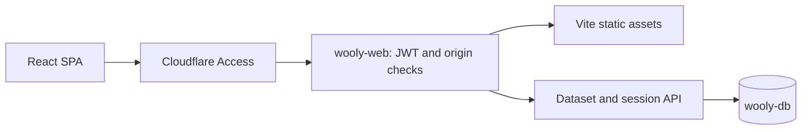

# Maintainer notes

Current architecture, domain behavior and UI constraints for Wooly v1. Source paths are relative to the repository root. [AGENTS.md](../AGENTS.md) defines the quality contract; [development and deployment](08-development.md) covers operations. Historical design documents are listed separately in the [index](README.md).

## Architecture

The browser runs a Vite React SPA. Cloudflare Access admits identities at `wooly.hexly.ai`; the `wooly-web` Worker also validates the Access assertion before serving assets or private APIs. The Worker retains the existing `wooly-db` database.

### MVVM boundaries

| Layer | Location | Responsibility | Verification |
| --- | --- | --- | --- |
| Model | `src/models/` | Pure, immutable CRUD, validation and calculations; no React or network state | Unit tests with inline fixtures |
| ViewModel | `src/viewmodels/` | Compose real models, hold form/page state and expose UI-ready values | `renderHook` and `act` with real fixture data |
| View | `src/pages/`, `src/components/` | Render Basalt controls and call ViewModel actions | Critical browser journeys |
| Data | `src/data/api.ts`, `src/hooks/use-dataset-context.tsx` | Same-origin transport, shared cache and debounced sync | Browser journeys; API behavior also has real HTTP tests |
| Worker | `worker/src/` | Access verification, payload validation, D1 mapping and persistence | Worker unit tests and local HTTP tests |

Views delegate business behavior to ViewModels. ViewModel tests replace `@/hooks/use-dataset` through `mockUseDatasetModule()` in `src/test/viewmodels/setup.ts`; they do not mock model functions. Model tests use inline fixtures rather than importing `mock.ts`.

### Providers and navigation

`src/main.tsx` mounts `App`. `src/App.tsx` supplies `BrowserRouter`, `SessionProvider`, Basalt providers and lazy page routes. `AppShellRoute` checks the session before mounting `DatasetProvider` and `DashboardLayout`.

`DatasetProvider` stays mounted across household routes. `DashboardLayout` keys its inner layout by `pathname`, resetting page ViewModels and mobile navigation state without discarding the shared dataset. Register new routes in `src/App.tsx`, `PAGE_TITLES` in `DashboardLayout.tsx` and `NAV_GROUPS` in `AppSidebar.tsx`.

### Dataset hydration and saving

All six ViewModels read `useDataset()`, which exposes `dataset`, `loading`, `error` and `scheduleSync`. The dashboard derives its display from the shared data. The five editable ViewModels hydrate local state once using `initializedRef`, then keep refs for full-dataset snapshots.

After a mutation, `scheduleSync(getLatest)` waits 500ms, updates the shared cache and PUTs the latest complete dataset. This preserves data between routes but provides no concurrency merge, automatic retry or durable offline queue. Sync failures are logged; navigating away from the application before the debounce completes can lose pending changes. Preserve every collection when constructing a save payload.

## Domain model

The authoritative fields are in [src/models/types.ts](../src/models/types.ts), the payload shape in [src/data/datasets.ts](../src/data/datasets.ts), and server validation in [worker/src/validator.ts](../worker/src/validator.ts).

Access identities share one household dataset. `Member` records represent beneficiaries, not login accounts or separate tenants.

| Entity | Important fields and relationships |
| --- | --- |
| `Member` | `name`, `relationship`, `avatar`; relationship values are `self`, `spouse`, `parent`, `child`, `sibling`, `other` |
| `Source` | `memberId`, `category`, `currency`, `cycleAnchor`, `validFrom`, `validUntil`, `archived`, `website`, `icon`, `phone`, `memo`, `cost`, `cardNumber`, `colorIndex`, `cardNetwork` |
| `Benefit` | `sourceId`, `type`, `quota`, `creditAmount`, `shared`, nullable `cycleAnchor`, `memo`; inherits currency and default cycle from Source |
| `Redemption` | `benefitId`, `memberId`, `redeemedAt`, `memo`; records an event, with no monetary amount field |
| `PointsSource` | `memberId`, `name`, `icon`, `balance`, `memo`; no currency field or automatic balance integration |
| `Redeemable` | `pointsSourceId`, `name`, `cost`, `memo`; records an item and its points cost |

`Source.cost` and `cardNumber` are free text. `colorIndex` is a persisted account color selection (1–36 or null). Archiving excludes a source from active calculations while retaining its history. A source's expiry and its archive state are separate.

### Benefit types

| Type | Behavior | Example |
| --- | --- | --- |
| `quota` | Each redemption consumes one of `quota` uses | Three lounge visits per quarter |
| `credit` | One full-amount redemption per cycle, using `creditAmount` for display | Annual health-check allowance |
| `action` | Reminder only; no redemption count | Annual policy review |

Points balances and actual exchanges are maintained manually. Expiry reminders appear in the app; no scheduled email or push notification service is implemented.

### Cycle system

`CycleAnchor` has `period: "monthly" | "quarterly" | "yearly"` and `anchor: number | { month: number; day: number }`. Monthly anchors use a day number; quarterly/yearly anchors use month and day. A benefit's non-null anchor overrides the source anchor.

The pure engine in `src/models/cycle.ts` accepts date strings:

- `getCurrentCycleWindow(today, anchor)` returns `{ start, end }` as `YYYY-MM-DD` strings, with inclusive start and exclusive end.
- `computeBenefitCycleStatus(benefit, sourceAnchor, redemptions, today)` returns the window, used/total counts, usage ratio, expiry information and status.
- Filter `redemptions` by `benefitId` before passing them to the engine. It counts dates in the window and does not filter by benefit itself.
- Compute `today` using the configured timezone before calling the engine. `countRedemptionsInWindow` compares `redeemedAt.slice(0, 10)`; it does not convert timestamps between timezones.

### Source icons

Resolution priority is website favicon (`https://favicon.im/{domain}`), manual icon, then category icon. Components handle failed favicon loads. Account favicons and card-network marks remain independent of the Wooly brand.

## Persistence and API

The dataset contains six arrays (`members`, `sources`, `benefits`, `redemptions`, `pointsSources`, `redeemables`) and one settings object (`defaultSettings: { timezone }`). All seven top-level fields travel together.

The Worker validates structure and foreign-key references, then replaces rows in one D1 batch, deleting in reverse dependency order and inserting in forward order. Concurrent saves replace each other; there are no per-entity REST endpoints or revision checks.

| Endpoint | Method | Response or boundary |
| --- | --- | --- |
| `/api/live` | GET | Public health/version and D1 connectivity; HTTP 503 if the database check fails |
| `/api/session` | GET | `{ user: { email, name } }` from verified Access claims |
| `/api/data` | GET | Full household dataset |
| `/api/data` | PUT | Full overwrite; returns the dataset read back from D1 |
| `/api/data/reset` | POST | `{ ok: true }`; requires local/test environment and `ALLOW_RESET=true`, plus authentication and origin checks |

Invalid dataset input returns 400; unknown API paths return JSON 404 and unsupported API methods return 405. API paths never fall through to the SPA. Every `/api/*` response uses `Cache-Control: no-store`, including health and errors.

## Authentication

Cloudflare Access is the production identity provider. Team and audience are configured in `wrangler.jsonc`. `worker/src/auth.ts` uses `jose` to verify RS256 signatures, issuer, audience, expiry and identity claims against cached public JWKS. Mutation requests require a matching `Origin` and reject `Sec-Fetch-Site: cross-site`.

The UI reads `/api/session`; `/login` is a recovery page. Recovery navigates the top-level browser through Access again, and logout navigates to `/cdn-cgi/access/logout`. Local identity requires explicit local/test bindings, a configured email and the trusted-host checks in `localRequest`; it never activates in production.

## Pages

| Route | UI title / role | ViewModel |
| --- | --- | --- |
| `/` | 仪表盘 | `useDashboardViewModel` |
| `/sources` | 权益账户 | `useSourcesViewModel` |
| `/sources/:id` | 账户详情; source name in page content | `useSourceDetailViewModel` |
| `/sources/points-:id` | Points branch of the same detail route | `usePointsDetailViewModel` |
| `/tracker` | 核销台 | `useTrackerViewModel` |
| `/settings` | 设置 | `useSettingsViewModel` |
| `/login` | Access session recovery | `useSession` |

`PointsSourceCard` links to `/sources/points-{id}`. `SourceDetailPage` detects the `points-` prefix; it is not a separate router registration. Unknown client routes navigate to `/`. Static asset SPA handling preserves direct nested URLs.

## Design system

Use published `@nocoo/basalt` controls at the version in `package.json`. `BasaltProviders` connects its `LinkProvider` to React Router's `Link`. Keep the Chinese product UI, compact vertical layout, design tokens and existing controls.

- Surfaces: Basalt background (L0), `ContentIsland` (L1), `LayerCard` (L2), `LayerCard.Well` (L3). Do not reintroduce generic parallel background/card tokens.
- Accent: Magenta via `AccentProvider.paletteOverrides`, `320 70% 55%` light and `320 70% 60%` dark.
- Account palette: `--chart-1` through `--chart-24` base colors, 25–30 dark-card treatments, 31–36 light-card treatments. Preserve all 36 persisted indices in `src/lib/palette.ts` and `src/app/globals.css`.
- Typography: bundled Latin Inter for body, DM Sans for `font-display`, Caveat 700 for the `font-handwriting` wordmark; Chinese text uses system fallbacks. Fonts enter through `src/styles/fonts.css` and `src/main.tsx`.
- Tailwind v4 uses `@theme inline` and the Vite plugin. `src/app/globals.css` remains the stylesheet location; there is no Next.js routing in that directory.
- Use `@/*` imports for `src/*`, palette helpers for chart/card colors, and Basalt tokens for surfaces and controls.
- CRUD dialogs use controlled `open`, `onSubmit` and local form state. Model validation returns `ValidationError[]`; ViewModels surface errors to the UI.
- Keep `T extends object` for interface-compatible helpers such as `stripUndefined`; interfaces lack implicit `Record<string, unknown>` index signatures.

Biome enforces `useHookAtTopLevel` and `useExhaustiveDependencies`. It does not currently enforce the former ESLint `react-hooks/set-state-in-effect` and `react-hooks/refs` rules. Use appropriate external-store hooks for browser subscriptions; do not add lint suppressions to imitate absent rules.

## Logo system

Root `logo.png` is the canonical 2048 × 2048 transparent sheep master, adopted from `wooly/2026-09-07-02`, finishing `01`. Preserve the fleece entry, wink, tongue and feature margins; identity changes require explicit direction. The selected presentation adds the rose background, texture and shadows without replacing the identity.

`Logo` uses `public/logo-{24,80}.png`. Browser, Apple touch and social assets live in `public/` and are referenced by `index.html`; README uses `assets/brand/icon-rounded.png`. Reproduction and source hashes are documented in [the brand guide](../assets/brand/README.md) and [source.json](../assets/brand/source.json).

## Operations

Daily development uses port 7014 and local D1. Browser tests use port 27014 and temporary SQLite; never start a competing daily server for validation. Commands, credentials, CI/CD and schema migration boundaries are in [development and deployment](08-development.md). Cutover evidence and the retained infrastructure cleanup list are in [the migration record](11-workers-migration.md). Accident narratives belong in [Retrospective.md](../Retrospective.md).
